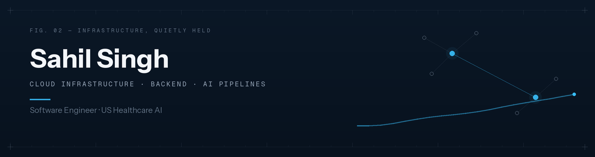

Software engineer at **Innosolve Labs** — the India engineering arm of a US healthcare AI
startup. I own our AWS infrastructure: production, staging, pre-stage, and everything
that pages me at 2 AM.

### What that's looked like this year

💸 **Cut our monthly AWS bill by 65%.** Not with a fancy tool — by actually reading the
console. Right-sized instances, deleted orphaned EBS volumes that had been billing us
since before I joined, killed snapshots nobody could explain.

📟 **Built the monitoring stack from zero.** 12 custom interceptors watching API health,
AI cost per request, and Celery task failures. Alerts over email, SMS, and WhatsApp,
deduplicated through Redis so nobody gets paged twice for the same fire.

🔐 **Locked down the perimeter** after a bot spent a night brute-forcing our SSH.
Audited every security group, restricted ingress to known CIDRs, rolled out GuardDuty,
rotated every IAM key — then moved deployments to SSM so there's no SSH door left to
knock on.

🤖 **Wired Claude and OpenAI into clinical document pipelines** — classification, note
generation, ICD-10 extraction — with per-provider daily cost caps, because an LLM with
no budget limit is an incident waiting for a timestamp.

### Day-to-day stack

### Worth a look

| Repo | What it is |
|---|---|
| [`aws-multi-region-infra`](https://github.com/amberIS01/aws-multi-region-infra) | Terraform modules for active/active VPCs across two AWS regions — per-AZ NAT, bastions, tiered security groups |
| [`voice-ai-agent`](https://github.com/amberIS01/voice-ai-agent) | Real-time voice agent chasing sub-2s end-to-end latency, with per-segment latency metrics |
| [`ocr-pii-pipeline`](https://github.com/amberIS01/ocr-pii-pipeline) | OCR + PHI detection for handwritten medical documents — deskew, extract, redact |
| [`ecommerce-ai-agent`](https://github.com/amberIS01/ecommerce-ai-agent) | LangGraph conversational shopping assistant backed by a RAG pipeline |

### Numbers

### Elsewhere

[LinkedIn](https://www.linkedin.com/in/singhsahil73s) · [Portfolio](https://mywebsiteme.netlify.app/) · [LeetCode](https://leetcode.com/amber_01) · sahilsingh8300@gmail.com
